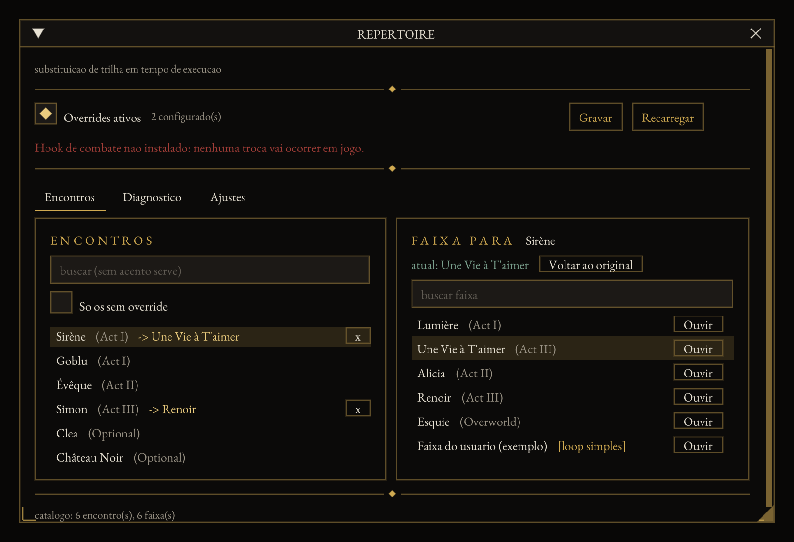

# E33 Boss Music Swapper

Runtime boss-music override for **Clair Obscur: Expedition 33**, as a UE4SS C++ mod
with a draggable in-game ImGui overlay.



> **Status: pre-alpha.** Not distributable yet — see the note under
> Installation. What it cannot do yet is
> swap a track: the combat hook and the audio call (M0/M2) need the game running
> and are not written. Everything around them — config, catalogue, decision
> logic, overlay — is built and tested.

## Why this instead of a `.pak` replacement

Existing music mods replace files inside the `.pak`, so the swap is permanent and
global, and the author has to ship several variants of the same mod. This one does
it at runtime:

- `config.json` ships **empty** — the game stays 100% vanilla until you say otherwise;
- every override is created from the in-game menu;
- no entry for an encounter means the hook does nothing and the original plays;
- "revert to original" per row;
- one global toggle disables every override at once, without uninstalling;
- one download, no variants.

Because the config is plain JSON, a full alternative soundtrack can be shared as a
single file instead of a new mod.

```json
{
  "enabled": true,
  "overrides": {
    "Boss_Simon": "Track_Renoir",
    "Boss_Sirene": "Track_UneVieATaimer"
  }
}
```

## Installation

**Requires** UE4SS installed in `Expedition 33\Sandfall\Binaries\Win64\`.

> **No release yet, and not for a reason in this repository.** Building any
> UE4SS C++ mod requires `Re-UE4SS/UEPseudo`, a **private** repository that
> RE-UE4SS needs as a submodule, and no SDK is published to link against
> instead. See [docs/BUILD-BLOCKER.md](docs/BUILD-BLOCKER.md) for what was
> checked and what the options are.

1. Extract the `BossMusicSwapper` folder to
   `Expedition 33\Sandfall\Binaries\Win64\ue4ss\Mods\BossMusicSwapper\`
2. Add a `BossMusicSwapper : 1` line to `ue4ss\Mods\mods.txt`. The bundled
   `enabled.txt` also works, but it bypasses mods.txt and gives up load ordering.
3. Start the game. **Nothing changes yet** — the config starts empty.
4. Press **F9** to open the menu.
5. Pick an encounter on the left, a track on the right. Done.

Tested game version: _TBD_.

## Building

The mod DLL is CMake, built alongside RE-UE4SS — that is the flow UE4SS
supports, and there is no import library to link against from outside:

```sh
# needs access to the private Re-UE4SS/UEPseudo submodule
git clone --recursive https://github.com/UE4SS-RE/RE-UE4SS external/RE-UE4SS
cmake -B build -G Ninja -DCMAKE_BUILD_TYPE=Game__Shipping__Win64
cmake --build build
cmake --build build --target package   # the installable zip
```

Everything else builds anywhere, and is how the project is developed off-Windows:

```sh
xmake f -y                      # fetches nlohmann_json, doctest, imgui, glfw
xmake build tests && xmake run tests      # logic suite, no game needed
xmake build harness && xmake run harness  # the overlay in a native window
```

The harness draws the same overlay the mod draws in-game, with a combat
simulator standing in for the hook and a recording backend standing in for the
game's audio. Sample fixtures live in `harness/sample/` and are deliberately
separate from `data/` — their ids are invented.

See [docs/DEV-MACOS.md](docs/DEV-MACOS.md) for the full split of what runs where.

## Roadmap

| Milestone | State |
|---|---|
| M0 — log the encounter id when combat starts | needs the game; `simulate()` stands in for it |
| M1 — `bosses.json` / `tracks.json` catalogue | loader, search and "seen in game" done; real ids need the game |
| M2 — swap to a **native** game track | decision logic done; the audio call needs the game |
| M3 — JSON config, empty by default, hot reload | done |
| M4 — ImGui overlay | done (in the harness; in-game ImGui registration unverified) |
| M5 — verbose logging, presets, release | logging and presets done |
| M6 — external audio via Wwise `.wem` | not started (optional) |

Native tracks are preferred: the E33 soundtrack was written to soften during
recovery windows and intensify at the climax of a fight. A flat external loop
loses that.

**The soundtrack is never distributed with this mod.** You supply your own files.

## Interface

The palette comes from the game's own material library — obsidian, black
marble, gold — with gold used only as rule, border and highlight, mitred
corners, letterspaced capitals and diamond fleurons. Text is EB Garamond, a
French old-style shipped under the OFL: the game's own face is third-party and
cannot be redistributed in a mod. Swap `assets/fonts/EBGaramond.ttf` for your
own if you prefer; the overlay falls back to ImGui's default if it is missing.

The screenshot above is generated, not hand-taken:

```sh
xmake run harness --shot shot.bmp --frames 40 --demo
```

## License

MIT — see [LICENSE](LICENSE). Bundled font under the SIL OFL 1.1, see
[assets/fonts/](assets/fonts/).
